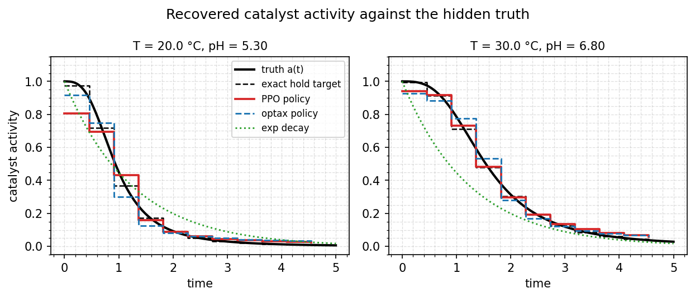
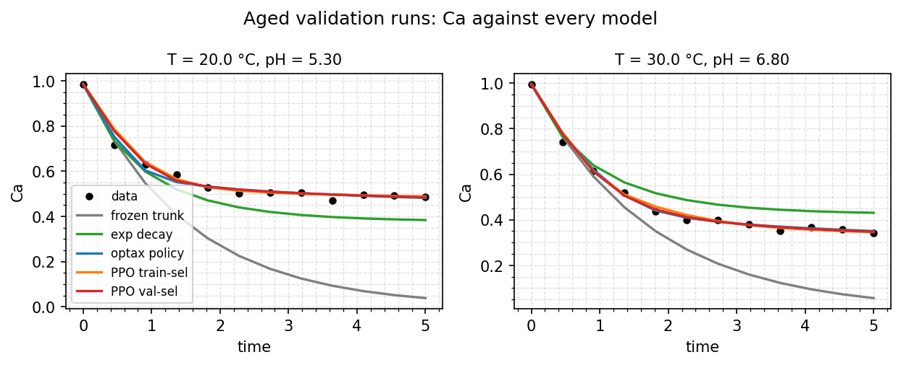

# Batch reactor, part two: a bounded controller trained by RL

The [batch reactor page](/examples/batch-reactor) fitted a rate constant $k(T, \text{pH})$ on fresh catalyst. This page takes that model, freezes it, and runs it on a reactor whose catalyst fouls as the batch proceeds. A policy learns the missing activity, trained by PPO, without ever differentiating the ODE.

```bash
uv run python examples/batch_reactor/train_hybrid.py --no-plot \
    --save-predictors examples/batch_reactor/artefacts/trunk_fresh.eqx
uv run python examples/batch_reactor/train_rl_deactivation.py
```


## Parameters as control actions

The framing comes from Mowbray, Wu, Rogers, Del Rio-Chanona and Zhang, [*A reinforcement learning-based hybrid modeling framework for bioprocess kinetics identification*](https://doi.org/10.1002/bit.28262) (2023). Kinetic parameters become control actions. A policy maps the current model state to a bounded parameter vector at each interval, the mechanistic model integrates one interval with that value held fixed, and reward is the fit error at the next measurement.

Written out, with $x^m$ the model's own state and $p_t$ the parameters:

$$
\max_\pi \sum_{t=0}^{T-1} R(x^m_t, p_t, x^m_{t+1}),
\qquad x^m_{t+1} = f(x^m_t, p_t),
\qquad p_t = \pi(x^m_t) \in \mathcal{P}
$$

Two features matter here. The rollout is **free-running**: the policy consumes the state its own previous actions produced, not the measurement, so errors compound and the trained policy is a model you can roll forward on a new batch. And $\mathcal{P}$ is a **hard constraint**, which is where this library has something to say.

## The system

Fresh catalyst obeys the truth the earlier page fitted. Aged catalyst multiplies it by an activity factor:

$$
k(T, \text{pH}, t) = a(t, \text{pH}) \cdot k_\text{fresh}(T, \text{pH}),
\qquad
a(t, \text{pH}) = \frac{1}{1 + \left(t / \tau(\text{pH})\right)^{3}}
$$

with $\tau$ shortening at low pH, so acid attacks the catalyst sooner. The cubic exponent gives a plateau followed by a sharp fall.

That shape is chosen deliberately. First-order deactivation, $a(t) = e^{-k_d t}$, would make $\mathrm{d}C_A/\mathrm{d}t = -k e^{-k_d t} C_A$ solvable in closed form, and one extra trainable scalar would fit it exactly. A time-varying policy would be decorative. A cubic Hill curve has no such shortcut.

The fouling is severe: the batch stalls at roughly 55% conversion where the fresh-catalyst model predicts it runs nearly to completion. That is the point. A starting model that is already good makes the exercise pointless.

## Bounds without a tanh squash

Continuous-control RL normally bounds actions by squashing a Gaussian through `tanh` and rescaling, then correcting the log-probability by the squash's log-det-Jacobian. This example does something else.

The policy is an ordinary `BoundedPredictor`, split at its output scaler:

```python
policy = BoundedPredictor(
    input_keys=("Ca", "temperature_C", "pH"),
    in_scaler=BoundScaler(bounds=OBS_BOUNDS, transform="sigmoid"),
    inner=MLPPredictor(in_size=3, out_size=1, width_size=32, depth=2,
                       activation_name="tanh", key=key),
    out_scaler=BoundScaler(bounds=((0.0, 1.05),), transform="sigmoid"),
)
```

The **action is the latent** $z$. The input scaler and inner network produce the Gaussian's mean over $z$; `out_scaler.from_latent` maps $z$ into the physical box inside the rollout, as part of the dynamics rather than part of the distribution. So:

- The log-probability is a plain diagonal Gaussian. There is no correction term, because nothing was squashed inside the policy.
- The bound is structural. No finite $z$ maps outside the box, so no clip is needed and none exists.
- `BoundScaler.saturation(z)` enters the reward, discouraging the policy from parking on the flat part of the squash where the mapping stops responding.

Recombined, the two halves are exactly `BoundedPredictor.__call__`. The trained artefact is a plain predictor that drops into `predict_dataset` with nothing special about it. A test pins that identity, because if the split ever drifts the trained model silently stops being the model that was evaluated.

The upper bound is 1.05, not 1.0. A fresh catalyst has activity exactly 1 and a sigmoid only approaches its edge asymptotically, so a hard ceiling would force the policy to saturate at $t = 0$ and set the saturation term fighting the fit. Five percent of headroom removes the conflict.

## No gradient through the solver

PPO differentiates the policy's log-probability and the value head. The rollout produces rewards and is never differentiated.

```python
rollout = rollout_batch(agent, episodes, key, ...)   # no gradient anywhere
advantages, targets = _advantages_and_returns(rollout)
agent, opt_state, loss = ppo_update(agent, opt_state, batch, ...)  # no ODE
```

The update recomputes log-probabilities from stored observations and latents. It never re-enters `diffeqsolve`. Consequently `SolverConfig.adjoint` does not matter to this training loop at all, and the solver could be stiff, nonsmooth, or a black box without changing anything.

That is the honest reason to reach for RL on a problem whose gradient is perfectly well-behaved, and it is the same argument the library's [evosax trainer](/guide/training) makes by a different route.

## Reward

$$
r_t = \exp\!\left(-\frac{(C_A^{m} - C_A^{d})^2}{\sigma^2}\right) - w \cdot \operatorname{saturation}(z_t)
$$

The first term is the paper's bounded form, with the weight taken from `ChannelObs.variance`, which the dataset already carries, rather than an arbitrary constant. The penalty reads the **latent**, not the physical activity: `from_latent`'s derivative carries a $\sigma'(z)$ factor that underflows to zero exactly where saturation is worst, so a penalty written against the output would die where it is needed.

The return is undiscounted. It is a fit criterion over a finite horizon, not a control return, and discounting would down-weight late measurements for no modelling reason.

### The return does not top out at the horizon

With $r = \exp(-\varepsilon^2/\sigma^2)$ and residuals $\varepsilon \sim \mathcal{N}(0, \sigma^2)$ at the true model, $\mathbb{E}[r] = 1/\sqrt{3} \approx 0.577$. Over 11 intervals, a perfect model scores about 6.35, not 11.

Nor is that a ceiling. Scoring **above** the true law means fitting observation noise, and the script reports the ratio when it happens.

### The exact target is the interval mean

Activity is held constant across each interval. For $\mathrm{d}C_A/\mathrm{d}t = -k\,a(t)\,C_A$ the solution over an interval is $C_A(t_1) = C_A(t_0)\exp\!\left(-k\!\int a\right)$, so only the integral of $a$ enters. Holding activity at its **interval mean** reproduces the continuous truth exactly; holding it at the left endpoint systematically overestimates on a falling curve.

So the step function the policy emits is not sampling $a(t_i)$. It is recovering the piecewise-constant activity that best represents each interval, and that target is exact rather than approximate. Every model on this page goes through the same hold, so the discretisation is not a handicap applied only to the policy.

## Results

Aged validation set, 600 PPO updates. `gap` is train $R^2$ minus validation $R^2$.

| model | train $R^2$ | val $R^2$ | val RMSE | gap |
|---|---|---|---|---|
| frozen trunk, no deactivation | -0.6217 | -0.9343 | 0.2413 | +0.3126 |
| trunk + fitted exponential decay | 0.8406 | 0.8641 | 0.0640 | -0.0235 |
| trunk + policy, optax backprop | 0.9934 | 0.9894 | 0.0178 | +0.0039 |
| trunk + policy, PPO, train-selected | 0.9944 | 0.9836 | 0.0222 | +0.0108 |
| trunk + policy, PPO, validation-selected | 0.9933 | 0.9875 | 0.0194 | +0.0058 |

The static hybrid model scores worse than predicting the mean. A one-scalar deactivation law recovers most of the damage but cannot represent the plateau. Both learned policies reach $R^2 \approx 0.99$.

Reference returns: the true deactivation law scores 5.73 against its own noisy data, no deactivation scores 0.78, the pure-noise optimum is 6.35.

**The gradient fit edges out PPO.** On a problem this smooth that was the expected outcome, and it is the accurate conclusion: PPO reaches essentially the same model while never touching the adjoint. If the claim were that RL fits better, this page would be an advert rather than a result.

The 600-update default run in pictures:





The activity figure is the honest summary: the truth is a cubic-Hill
plateau, the fitted exponential is a curve that cannot bend twice, and
both policies track the plateau — while staying inside their structural
activity box, no clipping anywhere. The trajectory figure shows why the
frozen trunk (grey) is worse than predicting the mean on aged runs: it
runs the batch nearly to completion when fouling has already stalled it.

## Over-parameterisation, shown rather than described

Training return climbs to 7.49, which is 1.31 times what the true law scores on the same data. Validation return peaks at 6.54 around update 130 and then falls back to 6.3.

Eleven free actions per run against twelve noisy observations leaves room to fit the noise, and the policy takes it. Selecting on training return, the only signal an honest RL loop has, picks the overfitted iterate. The script therefore returns two agents, one selected each way, and reports both rows above.

Worth noting where the validation curve peaks: almost exactly at the true law's own score, which is where theory says it should.

## Why rlax

`rlax` supplies `truncated_generalized_advantage_estimation` and `clipped_surrogate_pg_loss` as bare array functions. It imposes no network framework and no environment API, which is what lets the actor stay an equinox `BoundedPredictor` and the environment stay a `lax.scan` of `diffeqsolve` calls over a fixed dataset. `rejax`, `Stoix` and `purejaxrl` are all flax-based and expect a gymnax-style `env.step`, which would have pushed `BoundScaler` out of the actor entirely.

One function is not borrowed: `rlax.entropy_loss` is categorical, reducing a softmax entropy over unnormalised logits. A diagonal Gaussian's differential entropy is a closed form in `log_std`, computed directly.

The dependency lives in the `examples` extra, not in the core package.

PPO rather than the paper's SAC: the MDP is deterministic, the horizon is 11 steps, and rollouts are nearly free, so off-policy replay buys little against roughly twice the code.

## What runs

85 seconds end to end on CPU, including both optax baselines and 600 PPO updates over 576 episodes each.

Design decisions, and the five things the implementation corrected in the original design, are recorded in `examples/batch_reactor/SPEC_RL.md`.
