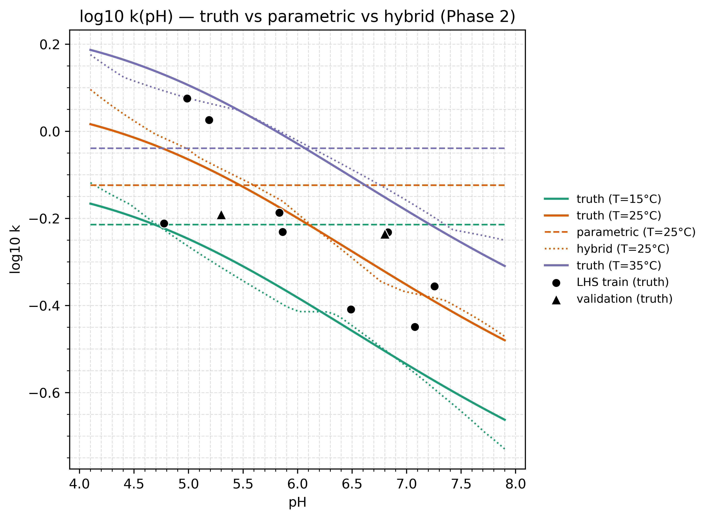
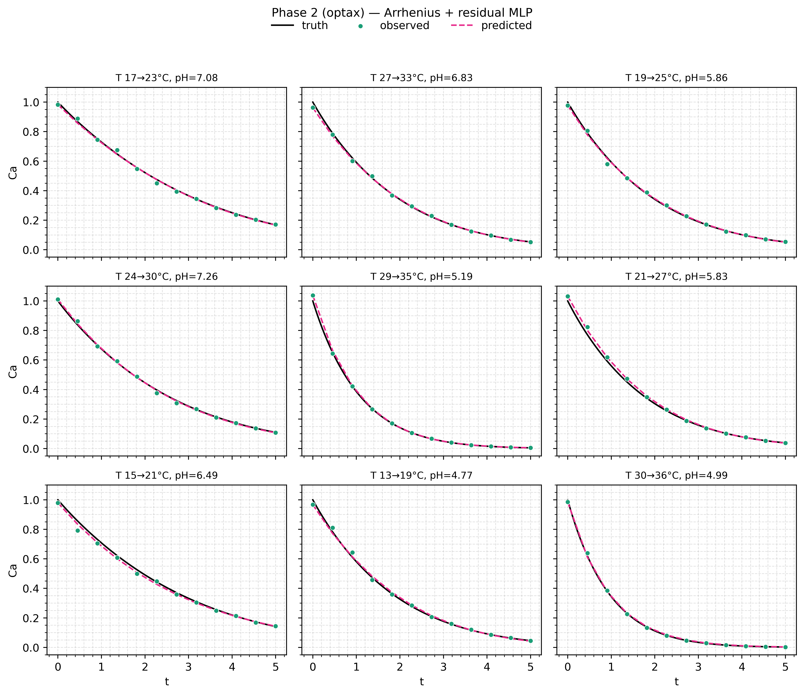

# Batch reactor

A first-order reaction $A \to B$ whose rate constant depends on
temperature through Arrhenius, which we know, and on pH through a curve
with no first-principles form, which we do not. The classical fit gives
you one set of Arrhenius constants per pH and no way to predict between
them. The hybrid model keeps the Arrhenius trunk and adds a small
bounded residual network, so one model covers every pH at once and
interpolates. Fitted in two stages: CMA-ES for the parametric trunk,
then gradients for the residual.

Run it yourself with:

```bash
uv run python examples/batch_reactor/train_hybrid.py
```

## Results

Default settings, seed 0: 60 CMA-ES generations for the parametric trunk,
then 800 AdamW steps for the residual. The k-reveal plot is the whole
story — the parametric trunk cannot see pH, so all its curves are flat,
and the hybrid model's curves track the truth across the pH range:





The validation points (triangles) at `(20 °C, 5.3)` and `(30 °C, 6.8)`
were never fitted. The residual bought one model with the pH shape to
approach them, instead of one Arrhenius fit per bin.

The batch-reactor page continues in [part two, the RL
example](/examples/batch-reactor-rl), which freezes this fitted trunk and
learns a catalyst-activity policy on top of it.