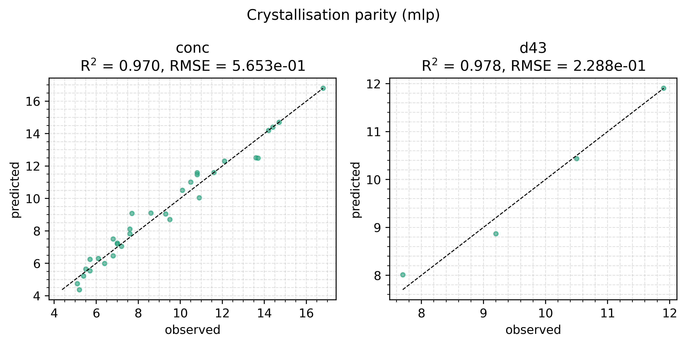
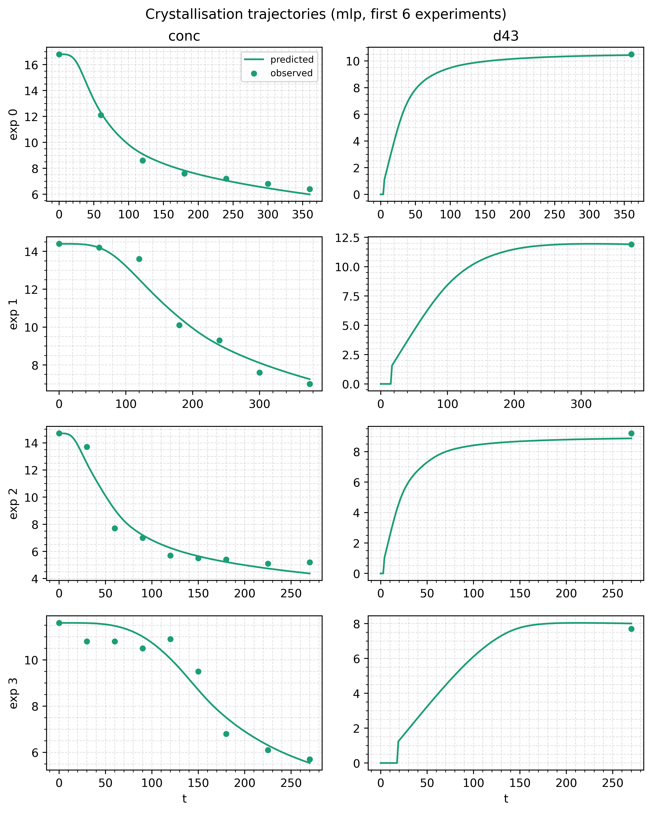

# Crystallisation (hybrid MLP)

The canonical end-to-end example: a hybrid kinetic model fitted to four
crystallisation experiments, each an irregular concentration trajectory
with one particle-size measurement at the end. Two neural networks emit
the unknown rate laws, and those rates drive a population-balance ODE.

**Crystallisation** is a dissolved solute leaving solution as solid
crystals, driven by **nucleation**, new crystals appearing, and
**growth**, existing ones getting larger. Nobody can derive either rate
from first principles for a given system, which is the situation this
library is for.

The full script is `examples/crystallisation/train_kinetic.py`:

```bash
uv run python examples/crystallisation/train_kinetic.py
```

The four experiments are written into it, so there is no external data
dependency. Every section here matches a section of the file.

## What we're modelling

A six-state population balance:

$$
\begin{aligned}
\frac{d\mu_0}{dt} &= J(t) \\
\frac{d\mu_k}{dt} &= k\, G(t)\, \mu_{k-1}, \quad k = 1, 2, 3, 4 \\
\frac{d\,\text{conc}}{dt} &= -3\, K_v\, \rho_c\, G(t)\, \mu_2
\end{aligned}
$$

The $\mu_k$ are **moments** of the crystal size distribution: $\mu_0$
counts crystals, $\mu_3$ tracks total volume, and $\mu_4 / \mu_3$ gives a
mean diameter. Tracking five moments instead of the full distribution
turns a partial differential equation into six ordinary ones.

$G$ (growth velocity, m/s) and $J$ (nucleation rate, per m³ per second)
are the unknowns. Rather than commit to Classical Nucleation Theory or a
power law, two networks learn $\log_{10} G$ and $\log_{10} J$ from
`(temperature_C, supersaturation)`, and the vector field exponentiates
back to physical rates inside the integrator. **Supersaturation** is
concentration over saturation concentration; above 1 the solution is
loaded and crystals can form.

Two quantities are observed: concentration (measured often) and the
volume-weighted mean diameter $d_{43} = \mu_4 / \mu_3 \cdot 10^6$ µm
(one measurement per experiment, at the end).

For a parametric counterpart that fits four scalars instead of two
networks, see [Crystallisation (mechanistic)](/examples/crystallisation-mechanistic).

## The dataset

Four experiments reproduced from the thesis `Unseeded_LowData4` cut,
rounded to 1 dp on values and 3 dp on variance. Concentration variance
is one made-up scalar (`CONC_VAR = 0.1`) broadcast across every row. The
$d_{43}$ variances are the rounded thesis values.

| `exp_id`      | T (°C) | n conc | n d43 | t span (min) | terminal d43 (µm) |
|---------------|-------:|-------:|------:|--------------|------------------:|
| `LowData4_3`  | 17.0   | 9      | 1     | 0 → 270      | 9.2               |
| `LowData4_4`  | 17.0   | 9      | 1     | 0 → 270      | 7.7               |
| `LowData4_7`  | 21.0   | 7      | 1     | 0 → 360      | 10.5              |
| `LowData4_9`  | 21.0   | 7      | 1     | 0 → 375      | 11.9              |

Two experiments at each of two temperatures, on different time grids.
`make_dataset` merges each experiment's per-channel timestamps into one
axis and groups by that axis's length, so training sees two groups.

## Step 1: define the experiments

An **experiment** is one run of the real thing. A **channel** is one
measured quantity with its own timestamps. A **covariate** is a
condition that stays fixed for the whole run.

```python
from hybridmodels import ChannelObs, Experiment, make_experiment

EXPERIMENTS_DATA = (
    {
        "exp_id": "LowData4_3",
        "temperature_C": 17.0,
        "time_min": (0.0, 30.0, 60.0, 90.0, 120.0, 150.0, 180.0, 225.0, 270.0),
        "conc": (14.7, 13.7, 7.7, 7.0, 5.7, 5.5, 5.4, 5.1, 5.2),
        "d43_time_min": 270.0,
        "d43": 9.2,
        "d43_var": 5.345,
    },
    # ... three more entries (LowData4_4, _7, _9), see the script
)
CONC_VAR = 0.1  # made-up uniform concentration variance, broadcast per row

def y0_fn(covariates, channels):
    """Initial state [mu0..mu4, conc]: moments at zero, conc at first observation."""
    init_conc = jnp.asarray(channels["conc"].values[0])
    return jnp.concatenate([jnp.zeros(5, dtype=init_conc.dtype), init_conc[None]])

experiments = []
for data in EXPERIMENTS_DATA:
    time_min = jnp.asarray(data["time_min"], dtype=float)
    conc = jnp.asarray(data["conc"], dtype=float)
    experiments.append(make_experiment(
        covariates={"temperature_C": float(data["temperature_C"])},
        channels={
            "conc": ChannelObs(
                ts=time_min, values=conc,
                variance=jnp.full_like(conc, CONC_VAR),
            ),
            "d43": ChannelObs(
                ts=jnp.asarray((data["d43_time_min"],), dtype=float),
                values=jnp.asarray((data["d43"],), dtype=float),
                variance=jnp.asarray((data["d43_var"],), dtype=float),
            ),
        },
        y0_fn=y0_fn,
        exp_id=str(data["exp_id"]),
    ))
```

`y0_fn` builds the ODE's full initial state. It runs once per
experiment, when you build it, never during training. Five moments start
at zero, because the suspension is nominally clear at `t = 0`.
Concentration starts at the first observed value. Temperature is the
only covariate; the thesis `Loading` column is uniformly zero across
`LowData4` and is dropped on purpose.

The two channels carry independent time axes. `conc` has 7 to 9 points
per experiment; `d43` has one, at the end. `make_dataset` recovers that
sparsity without any mask code from you.

## Step 2: the state_to_output projector

The integrator returns all six states. We observe two. `state_to_output`
maps one to the other, and here it also derives $d_{43}$ from two
moments.

```python
D43_MU3_EPS = 1e-6
D43_MAX = 55.0

def state_to_output(state):
    """[T, 6] -> [T, 2] in OUTPUT_CHANNELS = ('conc', 'd43') order."""
    mu3, mu4, conc = state[..., 3], state[..., 4], state[..., 5]
    safe_mu3 = jnp.where(mu3 > D43_MU3_EPS, mu3, 1.0)
    ratio = jnp.where(mu3 > D43_MU3_EPS, (mu4 / safe_mu3) * 1e6, 0.0)
    d43 = jnp.clip(jnp.where(jnp.isfinite(ratio) & (ratio > 0.0), ratio, 0.0), 0.0, D43_MAX)
    return jnp.stack([conc, d43], axis=-1)
```

The `safe_mu3` line is mandatory, not stylistic: replacing the divisor
before dividing is what keeps the gradient finite on the discarded
branch. See
[Recommendations](/guide/recommendations#guarded-division-must-guard-the-divisor-not-the-result).

## Step 3: build the dataset

```python
from hybridmodels import describe_buckets, make_dataset

dataset = make_dataset(experiments, output_channel_names=("conc", "d43"))
print(describe_buckets(dataset))
```

Two buckets. The 17 °C pair merge to length 9, since `d43_time_min=270`
already sits in the concentration grid; the 21 °C pair to length 7, their
`d43` times each already sitting in the concentration grid. Each bucket
compiles once and is reused for the whole run.

## Step 4: two bounded predictors

The convention is a tuple: `(growth_bp, nucleation_bp)`. Both take the
same two-key dict, and each `BoundedPredictor` picks out the keys named
in its `input_keys`.

::: info MLP and KAN side by side
The shipped script trains the same `(growth_bp, nucleation_bp)`
structure twice, once with an `MLPPredictor` inside and once with a
`KANPredictor`, writing figures into `figures/mlp/` and `figures/kan/`.
The walkthrough below shows the MLP path. The KAN swap is one line:
replace `MLPPredictor(...)` with
`KANPredictor(in_size=2, out_size=1, hidden_widths=(64,), grid_size=5, basis="spline", key=...)`.
Bounds, scalers, and the surrounding ODE are identical.
:::

```python
from hybridmodels import BoundedPredictor, BoundScaler, MLPPredictor

INPUT_KEYS = ("temperature_C", "supersaturation")
TEMPERATURE_BOUNDS = (13.0, 27.0)        # °C, slightly wider than data span
SUPERSATURATION_BOUNDS = (0.0, 12.0)     # S = conc / conc_sat
LOG10_GROWTH_BOUNDS = (-15.0, -5.0)      # log10(G [m/s])
LOG10_NUCLEATION_BOUNDS = (-6.5, 20.0)   # log10(J [#/(m^3·s)])

in_scaler = BoundScaler(
    bounds=(TEMPERATURE_BOUNDS, SUPERSATURATION_BOUNDS),
    transform="sigmoid",
)

k_growth, k_nucleation = jr.split(key, 2)

growth = BoundedPredictor(
    input_keys=INPUT_KEYS,
    in_scaler=in_scaler,
    inner=MLPPredictor(in_size=2, out_size=1, width_size=64,
                       depth=1, activation_name="relu", key=k_growth),
    out_scaler=BoundScaler(bounds=(LOG10_GROWTH_BOUNDS,), transform="sigmoid"),
)
nucleation = BoundedPredictor(
    input_keys=INPUT_KEYS,
    in_scaler=in_scaler,
    inner=MLPPredictor(in_size=2, out_size=1, width_size=64,
                       depth=1, activation_name="relu", key=k_nucleation),
    out_scaler=BoundScaler(bounds=(LOG10_NUCLEATION_BOUNDS,), transform="sigmoid"),
)

predictors = (growth, nucleation)
```

The bound choice matters more than anything else on this page. A fresh
network emits the midpoint of its output box, so that is what the
integrator sees on step 0. `LOG10_GROWTH_BOUNDS = (-15, -5)` puts it at
$G \approx 10^{-10}$ m/s, reasonable for early growth. An earlier
`(-12, -3)` draft put it at $G \approx 3 \cdot 10^{-8}$ m/s, large enough
that random weights produced rates the moment solver could not track
within `max_steps`. See
[Recommendations](/guide/recommendations#bounds).

::: tip Optional: pin the readout to the box midpoint
The nucleation box spans 26 decades, so even well centred an unlucky
readout draw can start far enough off midpoint to make the ODE
intractably stiff.
[`MLPPredictor.with_zero_final_head()`](/api/predictors#mlppredictor)
and its KAN counterpart zero the readout layer, putting the initial
output exactly at the midpoint whatever the key. Hidden layers keep their
random init.

```python
inner=MLPPredictor(in_size=2, out_size=1, width_size=64,
                   depth=1, activation_name="relu", key=k_growth).with_zero_final_head()
```

The shipped script runs without it on the default seed. Turn it on if
you hit `max_steps` on another.
:::

## Step 5: the vector field

This is where you write physics. The `simulate_fn` signature is fixed.
Everything inside it is yours.

```python
RHO_C = 1370.0    # crystal density [kg/m^3]
K_V = 0.81        # volumetric shape factor
META_EPS = 1e-5   # supersaturation must exceed 1 + eps for nucleation/growth

def simulate_fn(predictors, ts, covariates, y0, solver):
    growth_bp, nucleation_bp = predictors
    temperature_C = covariates["temperature_C"]
    # Empirical solubility polynomial in °C.
    conc_sat = (0.3705 + 7.171e-2 * temperature_C
                - 1.924e-3 * temperature_C**2
                + 17.97e-5 * temperature_C**3)

    def vector_field(t, y, args):
        mu0, mu1, mu2, mu3, _mu4, conc = y[0], y[1], y[2], y[3], y[4], y[5]
        S = conc / conc_sat

        # Predictor inputs. Temperature is a covariate, constant in time;
        # supersaturation comes from the state and changes every step.
        # The library treats every key as a named scalar either way.
        inputs = {"temperature_C": temperature_C, "supersaturation": S}

        meta_mask = (S > 1.0 + META_EPS).astype(y.dtype)
        log10_G = jnp.squeeze(growth_bp(inputs))
        log10_J = jnp.squeeze(nucleation_bp(inputs))
        G = meta_mask * jnp.power(10.0, log10_G)
        J = meta_mask * jnp.power(10.0, log10_J)

        return jnp.stack([
            J,                                 # dmu0
            G * mu0,                           # dmu1
            2.0 * G * mu1,                     # dmu2
            3.0 * G * mu2,                     # dmu3
            4.0 * G * mu3,                     # dmu4
            -3.0 * K_V * RHO_C * G * mu2,      # dconc
        ])

    times_sec = ts * 60.0  # dataset stores minutes; rate constants are SI seconds.
    sol = diffrax.diffeqsolve(
        diffrax.ODETerm(vector_field), solver.solver,
        t0=times_sec[0], t1=times_sec[-1], dt0=solver.dt0, y0=y0,
        saveat=diffrax.SaveAt(ts=times_sec),
        stepsize_controller=solver.stepsize_controller(),
        max_steps=solver.max_steps,
        adjoint=solver.adjoint,
    )
    return jnp.asarray(sol.ys)
```

Two notes. The metastable mask zeros both rates below $S = 1 + 10^{-5}$,
so the ODE stops moving once the solution is no longer loaded. And the
time conversion is one line, because keeping the dataset in minutes
makes the plots readable.

`solver.stepsize_controller()` and `solver.adjoint` come from the
`SolverConfig`. Building a `PIDController` by hand instead would silently
ignore a per-state `atol` tuple.

## Step 6: solver and training config

The moments span roughly 18 decades during an integration, so `atol`
gets one entry per state component.

```python
from hybridmodels import OptaxTrainingConfig, SolverConfig, train_with_optax

solver = SolverConfig(
    solver=diffrax.Tsit5(),
    rtol=1e-4,
    atol=(1e3, 1e-2, 1e-6, 1e-10, 1e-14, 1e-5),  # about 9 decades below each natural magnitude
    max_steps=500_000,
    dt0=None,
)

config = OptaxTrainingConfig(
    steps=(600,),
    lr=(1e-3,),
    optimizer=("adamw",),
    reset_optimiser_state=(False,),
    length_schedule=(1.0,),
    loss="mse",
    verbose=True,
)
```

One phase to start. Add a second at a lower learning rate once the loss
flattens.

## Step 7: train

```python
history, trained_predictors = train_with_optax(
    predictors, dataset, config,
    simulate_fn=simulate_fn, state_to_output=state_to_output,
    solver=solver, key=jr.PRNGKey(0),
)
print(f"final loss: {history[-1]:.6f}")
```

The first step pays for compilation, once per bucket shape. Every step
after that runs at full speed.

## Step 8: predict and inspect

```python
from hybridmodels import predict_dataset

predictions = predict_dataset(
    trained_predictors, dataset, simulate_fn=simulate_fn,
    state_to_output=state_to_output, solver=solver,
)
# One [N, T, D] array per bucket, in the same order as dataset.bucket_payloads.
# The buckets differ in T, so they cannot be stacked into one tensor.

# Read the trained rate laws at any condition you like.
sample_inputs = {
    "temperature_C": jnp.asarray(20.0),
    "supersaturation": jnp.asarray(1.5),
}
trained_growth, trained_nucleation = trained_predictors
log10_G = float(jnp.squeeze(trained_growth(sample_inputs)))
log10_J = float(jnp.squeeze(trained_nucleation(sample_inputs)))
print(f"G(20°C, S=1.5) = {10**log10_G:.2e} m/s, J = {10**log10_J:.2e} #/(m³·s)")
```

Reading the predictors at conditions no experiment visited is the point
of a bounded hybrid model. The script also writes parity and trajectory
plots under `examples/crystallisation/figures/`.

Default settings, seed 0, 600 steps for the MLP family:





The concentration parity sits close to the identity line across the full
concentration range, and the terminal `d43` points land within their
variance of the fitted curves. The KAN family (`--kan-basis spline`
defaults) reaches a similar concentration fit but recovers the `d43`
terminal size worse, which is the same least-expressive-model lesson the
[hybrid ODE](/examples/hybrid-ode#results) and [custom
predictor](/examples/custom-predictor#results) examples show.

## What's next

- [Crystallisation (mechanistic)](/examples/crystallisation-mechanistic).
  Same dataset and ODE, four fitted scalars instead of two networks,
  trained by CMA-ES.
- [Harmonic oscillator](/examples/pendulum). A synthetic counterpart with
  a known correct answer.
- [Recommendations](/guide/recommendations). Bounds, tolerances,
  freezing, guarded division.
- [Training](/guide/training). Phases, tournaments, population search.
- [API: Data](/api/data), [API: Predictors](/api/predictors),
  [API: Training](/api/training).
