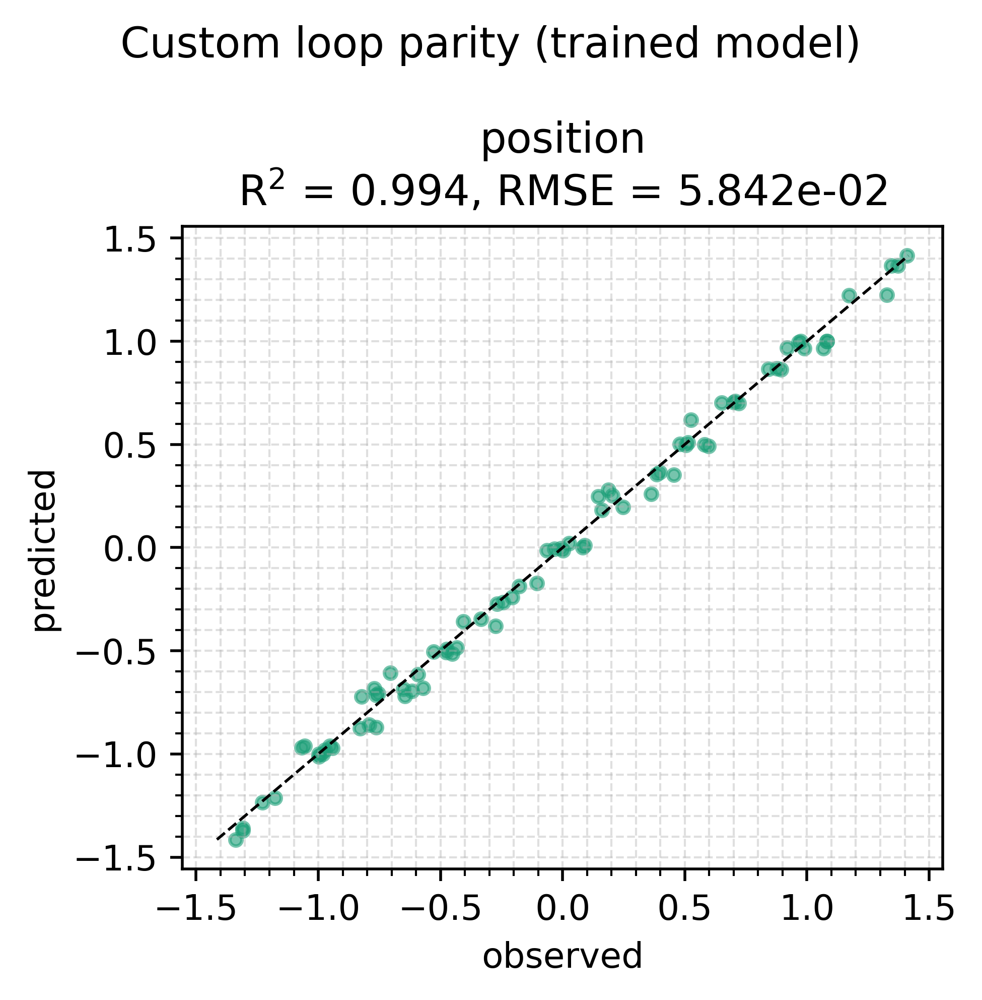

# Custom training loop

The stock trainers — `train_with_optax`, `train_with_evosax` — are
assembled from public pieces in `hybridmodels.training.kernels`. If you
want a loop the stock trainers do not express — a bespoke schedule,
per-bucket weighting, a custom regulariser, a different accumulation
rule — you compose those same kernels yourself instead of forking a
trainer.

This example recovers a harmonic oscillator's frequency `omega` from noisy
position data using a hand-written loop built from:

- `build_bucket_step` — the jitted per-bucket `(loss, grads)` kernel
  (one trace per bucket shape);
- `build_penalty_step` — charges a regulariser once per step, outside the
  bucket loop. Here it is a *custom* L2 regulariser on one leaf, not the
  default bound-saturation penalty;
- `build_apply_update` — the single optimiser update per step.

It also injects a custom masked-Huber loss and a per-bucket weight at the
call sites, exactly where a stock trainer would not let you.

```bash
uv run python examples/custom_loop/train_custom_loop.py
```

The loop body is the library's definition of a step — one full pass over
every bucket, accumulate gradients, then one update. Change the
accumulation rule and you have a genuinely different trainer.

## The script, in full

The example is a single file with no hidden parts — what you see is what
runs:

<<< ../../examples/custom_loop/train_custom_loop.py

## Results

Default settings, seed 0, 150 hand-rolled steps. The masked-Huber loss and
the per-bucket weight are the injected customisations; the L2 on `scale`
is the custom regulariser, charged once per step outside the bucket loop.



The recovered `omega = 0.999` against a true `1.0` is the same accuracy
the [pendulum example](/examples/pendulum) reaches through the stock
trainer — the loop is different, the physics pipeline is not.