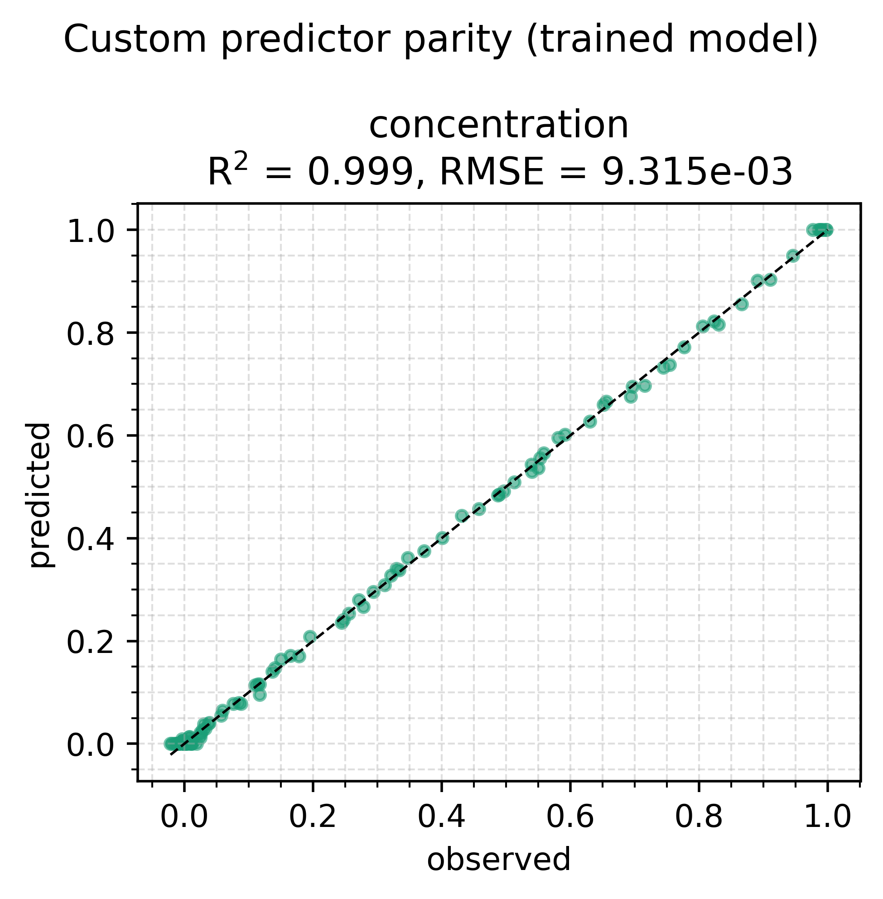
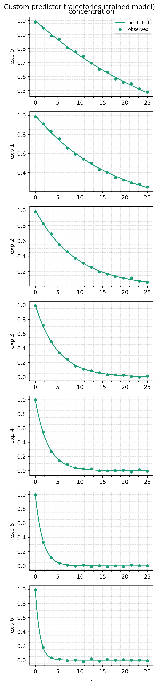

# Custom predictor: a predictor family of your own

The library ships an MLP and a KAN, but a predictor is only a trainable
module mapping an array to an array. This example writes a third family
from scratch and trains it inside a hybrid ODE. The framework never
learns that it is not an MLP.

The script lives at
`examples/custom_predictor/train_custom_predictor.py`. Run it with:

```bash
uv run python examples/custom_predictor/train_custom_predictor.py
```

The data is synthesised on every run, so there is no file to manage. The
procedure this example follows is written up in
[Custom predictors](/guide/custom-predictors).

## The problem

First-order decay whose rate depends on temperature:

$$
\frac{dy}{dt} = -k(T)\, y, \qquad k(T) = A \exp\!\left(-\frac{E_a}{R T}\right)
$$

Each **experiment** is one isothermal run: a temperature between 290 and
350 K, a decay curve of 15 noisy points, and the same initial
concentration $y_0 = 1$. All runs share a timestamp grid, so the dataset
is one fully observed bucket.

The Arrhenius form on the right is the answer, not an input. The
predictor sees a temperature and must produce a rate. The true rates run
from 0.029 to 0.998, which is 1.5 decades, so the output scaler warps
logarithmically.

## The predictor: random Fourier features

Random Fourier features project the input through a fixed random bank of
cosines, then fit linear weights on top:

$$
\phi(x) = \sqrt{\tfrac{2}{m}} \cos(x\,\Omega + b), \qquad f(x) = \phi(x)\,W + c
$$

The bank $(\Omega, b)$ is drawn once and never updated. Only the readout
$(W, c)$ learns. That is what makes this random *features* rather than a
one-hidden-layer network with a cosine activation.

```python
class RandomFourierPredictor(Predictor):
    weights: Float[Array, "n_features out_size"]      # trainable
    bias: Float[Array, " out_size"]                   # trainable
    frequencies: Float[Array, "in_size n_features"]   # fixed bank
    phases: Float[Array, " n_features"]               # fixed bank
    in_size: int = eqx.field(static=True)
    out_size: int = eqx.field(static=True)
    n_features: int = eqx.field(static=True)
    bandwidth: float = eqx.field(static=True)

    def __call__(self, x):
        features = jnp.sqrt(2.0 / self.n_features) * jnp.cos(x @ self.frequencies + self.phases)
        return features @ self.weights + self.bias
```

The split between trained and fixed arrays is the reason this
architecture was chosen for the example. It forces every question the
contract asks, and the next four sections are the four answers.

## Which fields are static

`in_size`, `out_size`, `n_features`, and `bandwidth` are
`eqx.field(static=True)`. They are shape and configuration, the
optimiser never sees them, and they are not written to the checkpoint.
The four arrays are ordinary fields and are written.

`bandwidth` is the standard deviation of the frequency draw. It sets the
length scale the features can resolve. Because `BoundScaler` hands the
inner predictor a latent input of roughly unit scale, a bandwidth near 1
is the sane starting point regardless of what the covariate's physical
units are. `--bandwidth` changes it.

## How it re-initialises

The run uses a three-attempt [restart
tournament](/guide/training#the-shared-tournament), so the module has to
be able to produce fresh weights. `initialized_with_key` rebuilds it
through `__init__`:

```python
def initialized_with_key(self, key: Array) -> RandomFourierPredictor:
    return RandomFourierPredictor(
        in_size=self.in_size, out_size=self.out_size,
        n_features=self.n_features, bandwidth=self.bandwidth, key=key,
    )
```

Leave it out and the default resamples all four arrays from a standard
normal. The phases would no longer be uniform on $[0, 2\pi)$, the
readout would lose its $1/\sqrt{m}$ scaling, and `bandwidth` would be
ignored. Shapes are unchanged by the rebuild, which matters: the
trainability mask is built before training and reused after a restart.

## How the bank is held fixed

A module cannot declare its own field untrainable. Trainability is a
boolean mask over the pytree, built by the caller:

```python
BANK_PATHS = ("0.inner.frequencies", "0.inner.phases")

mask = trainable_mask(predictors)
mask = freeze_paths(mask, BANK_PATHS)
```

The paths read from the root of the predictors tuple: element 0, its
`inner`, its `frequencies`. `freeze_paths` raises on a path that matches
no leaf, so renaming a field fails loudly instead of quietly training an
array you believed was fixed.

`--train-bank` skips the freeze, which turns the model into an ordinary
cosine-activation network. The results table below has both.

## How it round-trips

The script saves and reloads the trained predictor before reporting
diagnostics, and prints the largest change in the learned rate. It is
`0.000e+00`.

Loading needs a template with the same class, container shape, and
static fields, which the script builds by calling the same
`_build_predictor` used for training. That is the whole reason to keep
static fields to plain scalars: you have to be able to reproduce them at
the load site.

## Bounds stay outside

`RandomFourierPredictor` contains no bound, no covariate name, and no
unit. The wrapper supplies all three:

```python
BoundedPredictor(
    input_keys=("temperature",),
    in_scaler=BoundScaler(bounds=((280.0, 360.0),), transform="sigmoid"),
    inner=RandomFourierPredictor(in_size=1, out_size=1, ...),
    out_scaler=BoundScaler(bounds=((1e-2, 3.0),), transform="sigmoid", warp="log10"),
)
```

The input box is wider than the sampled temperatures so the scaler stays
clear of its saturating ends. The output box is loose on purpose: under
a `log10` warp, headroom costs almost no resolution.

## Where the predictor sits

The rate is constant along a trajectory, so `simulate_fn` calls the
predictor once, above `diffeqsolve`, and the network never touches the
solver tape:

```python
def _simulate_fn(predictors, ts, covariates, y0, solver):
    (rate,) = predictors
    k = rate(covariates).reshape(())

    def vector_field(t, y, args):
        return -k * y
    ...
```

See [Where a predictor sits relative to the
solver](/guide/concepts#embedded-and-parallel-predictors)
for the case where it cannot.

## Results

Default settings, seed 0, 400 steps after the tournament. "Worst rate
error" is the largest relative error in $k(T)$ across the seven sampled
temperatures.

| run | final data loss | $R^2$ | worst rate error |
|---|---|---|---|
| default: 64 features, bandwidth 1, bank frozen | 8.68e-05 | 0.9992 | **1.26%** |
| `--n-features 16` | 8.60e-05 | 0.9992 | 1.54% |
| `--train-bank` | 8.52e-05 | 0.9992 | 1.97% |
| `--bandwidth 8` | **8.44e-05** | **0.9993** | 3.34% |

Every row fits the trajectories to the noise floor, and the ranking on
trajectory loss is the reverse of the ranking on the rate law. The
wigglier and freer the basis, the better it fits 105 noisy points and
the worse it recovers $k(T)$. The errors concentrate at 340 and 350 K,
the edge of the sampled range, where a flexible basis is least
constrained.

That is the same trade the [hybrid ODE
example](/examples/hybrid-ode#results) shows with a KAN residual. If a
physical quantity is what you came for, the predictor wants to be the
least expressive thing that fits.

Sixteen features are enough here because the target is one smooth
monotone curve. The default is 64 to leave room for a harder rate law.

The default run (64 features, bank frozen) in pictures:





The parity scatter is noise-floor tight, and the trajectories show the
fit's worst point: the two coldest runs (least decay in the window), where
the rate law's relative error concentrates.

