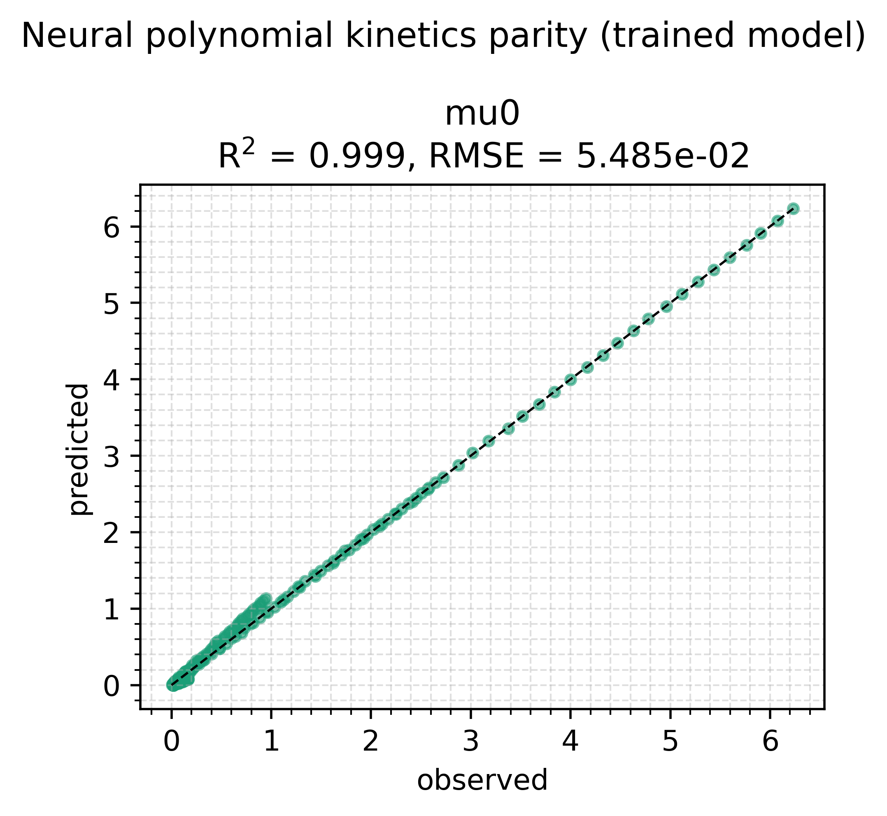
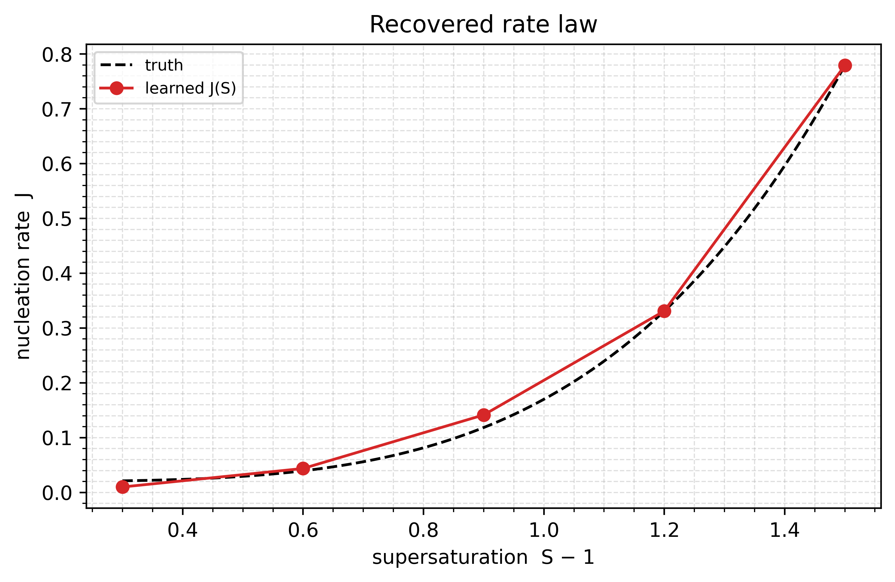

# Neural polynomial kinetics

The third predictor family alongside MLP and KAN: `NeuralNPolynomial`,
a per-channel scalar *polynomial* in the (latented) input whose
coefficients are produced by an inner trainable network. For
crystallisation-style kinetics this is a physics-flavoured prior — a rate
written as a power law in supersaturation `S - 1` — instead of a
black-box MLP.

The model is a two-moment crystallisation ODE

```
d mu0/dt =  J          (nucleation)
d mu1/dt =  G * mu0    (growth)
```

with growth `G` a known constant and nucleation `J` the unknown rate law.
`J` is a `NeuralNPolynomial`: polynomial in supersaturation (exponents
`2, 3, 4` — nucleation is strongly supersaturation driven) whose
coefficients `c_i(S)` come from an inner `MLPPredictor`. The polynomial
is wrapped in a `BoundedPredictor` so `J` stays in a physical range.

The dataset is synthetic: `J_true(S) = a * (S - 1)^4 + b`, and the fit
must recover the rate law from noisy `mu0` time-series across several
supersaturations.

```bash
uv run python examples/supersaturation_poly/train_supersaturation_poly.py
```

## A design fact this example surfaces

The polynomial basis is `sum(inner_input)` — the *latented* input — so
`NeuralNPolynomial` cannot separate "coefficients from condition A" from
"basis in condition B" in a single predictor. The physics-clean
crystallisation form (`sum_i c_i(T) * (S-1)^p_i`) therefore enters either
as one polynomial in `S-1` with `S`-conditioned coefficients (shown
here), or by composing two predictors. The latent-vs-physical basis is
the open design question (SPEC §2.3).

## The script, in full

The example is a single file with no hidden parts — what you see is what
runs:

<<< ../../examples/supersaturation_poly/train_supersaturation_poly.py

## Results

Default settings, seed 0, 400 steps. The `mu0` time-series fit to the
noise floor (`R^2 = 0.999`), and the rate law comes out close to the truth
`J(S) = 0.02 + 0.15 (S-1)^4`.





The recovered curve is a *polynomial in the latented input* wrapped in a
`BoundedPredictor`'s output scaler, so the shape is the network's and the
range is structural. The fit is best at high supersaturation, where
nucleation actually drives the observable dynamics.